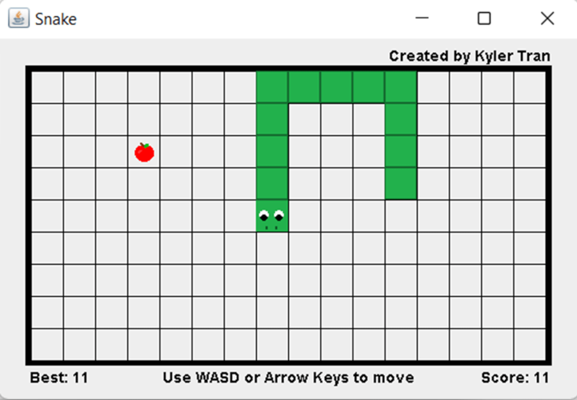

# Snake Remastered

**Copyright &copy; 2019 Kyler Tran**

Snake Remastered is a modern rendition of the classic Snake game. With entirely new art and responsive controls, this game brings a fresh look and feel to the timeless challenge of growing your snake while avoiding your tail and walls.

## How to Play

1. Use the arrow keys or WASD to control the direction of the snake.
2. Navigate the snake to collect food items that appear randomly on the screen.
3. Avoid colliding with the walls or the snake's own tail.
4. Try to score as high as possible by eating food without colliding.

## System Requirements

- A Windows or Mac computer with Java installed.

## Contact
Kyler Tran  
**Email**: [kylerzinbox@gmail.com](mailto:kylerzinbox@gmail.com)
